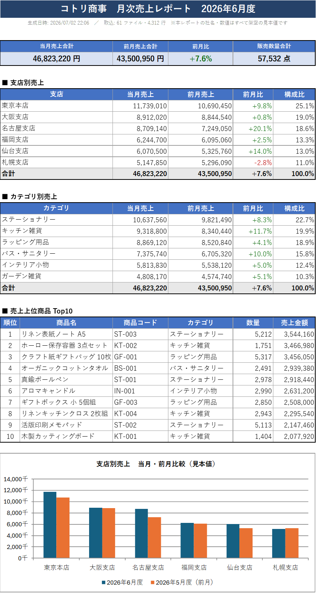

# 月次売上レポート自動集計ツール（VBA デモ）

架空の雑貨卸「**コトリ商事**」を題材にした、Excel VBA のポートフォリオ用デモです。
フォルダに溜まった日次売上CSVをボタン1つで一括取込し、月次集計 → A4印刷用の
月次レポートシート（前月比・支店別・カテゴリ別・上位商品・グラフ）まで自動生成します。

> **注意**: 登場する社名・支店・商品・売上数値は **すべて架空の見本値** です。
> 実在の企業・実務データとは一切関係ありません。

## デモでできること

1. `sample-data\csv\` の日次売上CSV（61ファイル・約4,300行）を一括取込
2. Dictionary によるピボット相当の月次集計（支店別／カテゴリ別／商品別）
3. 「月次レポート」シートを自動生成
   - サマリー（当月売上・前月売上・前月比・販売数量）
   - 支店別売上表（前月比・構成比、前月比はプラス緑／マイナス赤）
   - カテゴリ別売上表
   - 売上上位商品 Top10
   - 支店別売上の当月・前月比較グラフ
   - A4縦1ページに収まる印刷設定済み
4. 取込結果は「生データ」「取込ログ」シートでそのまま確認可能

処理はすべて配列ベース（セルへの逐次書き込みなし）＋画面更新OFFで、
**61ファイル・4,312行の取込〜レポート完成まで実測 約1.5秒**（見本データでの計測値）です。



## フォルダ構成

```
monthly-report/
├── README.md                  … このファイル
├── build.ps1                  … .xlsm 組み立てスクリプト（Excel COM）
├── monthly-report-demo.xlsm   … 生成済みのデモブック
├── src/                       … VBAソース（役割別に7モジュール・UTF-8）
│   ├── modMain.bas            … エントリポイント（実行時間計測つき）
│   ├── modConfig.bas          … 定数集約（シート名・色・取込設定）
│   ├── modUtil.bas            … 共通ユーティリティ（高速化スイッチ等）
│   ├── modImport.bas          … CSV一括取込＋取込ログ
│   ├── modAggregate.bas       … Dictionaryによる月次集計
│   ├── modReport.bas          … レポートシート組み立て＋印刷設定
│   └── modExport.bas          … PNG書き出し（ポートフォリオ掲載用）
├── sample-data/
│   └── csv/                   … 架空の日次売上CSV（2026/05〜06、61ファイル）
├── tools/
│   └── generate_sample_data.py … サンプルCSVジェネレータ（乱数シード固定）
├── docs/
│   └── manual-import.md       … AccessVBOM 未許可環境向けの手動組み立て手順
└── assets/                    … スクリーンショット（PNG）
```

## 再現手順

### A. 生成済みブックで試す（最短）

1. `monthly-report-demo.xlsm` を開く（マクロを有効化）
2. 「操作パネル」シートの［月次レポート生成］ボタンをクリック
3. 数秒で「月次レポート」シートが再生成される

### B. ゼロから組み立てる

```powershell
# 1. サンプルCSVの生成（再実行しても同じデータになります）
python tools\generate_sample_data.py

# 2. .xlsm の組み立て＋デモ実行＋スクリーンショット出力
pwsh -File build.ps1

# ビルドのみ（マクロ実行なし）の場合
pwsh -File build.ps1 -SkipDemo
```

- `build.ps1` は Excel の **AccessVBOM（VBAプロジェクトへのアクセス許可）** が有効な場合のみ
  モジュールを自動インポートします。未許可の場合は**設定を変更せず**メッセージを出して
  終了するので、`docs\manual-import.md` の手動手順を使ってください。
- CSVの文字コードは cp932（Shift_JIS）です。VBA 標準の `Open / Line Input` で
  そのまま読める、日本の実務で最も一般的な形式に合わせています。

## 設計のポイント（コードの読みどころ）

| テーマ | 場所 |
| --- | --- |
| 定数の一元管理（シート名変更に強い） | `modConfig.bas` |
| 画面更新OFF・手動計算などの高速化と確実な復元 | `modUtil.bas` `SpeedUp / RestoreAppState` |
| セル逐次書き込みをしない配列一括転記 | `modImport.bas` `WriteRawSheet` |
| Dictionary によるピボット相当の集計 | `modAggregate.bas` |
| 前月比の符号つき表示と色分け | `modReport.bas` `RatioText` |
| エラー時もアプリ状態を復元して安全に中断 | `modMain.bas` `RunReport` |
| COM自動実行を想定した MsgBox の分離 | `modMain.bas`（ボタン用と自動実行用の分離） |

## スクリーンショット

| ファイル | 内容 |
| --- | --- |
| `assets/01_csv-import-log.png` | 取込ログ（CSVファイル一覧と取込行数） |
| `assets/02_raw-data.png` | 生データシート（取込結果の先頭部分） |
| `assets/03_monthly-report.png` | 生成された月次レポート全体 |
| `assets/04_branch-chart.png` | 支店別売上グラフ（Chart.Export で出力） |

スクリーンショット自体も `Range.CopyPicture` ＋ `Chart.Export` の定番パターンで
自動生成しています（`build.ps1` の外部COMステップで実行。マクロ実行中の Paste は
OLE 遅延レンダリングの関係で白紙になる環境があるため、その回避策も含めて
`modExport.bas` のコメントに記載しています）。
